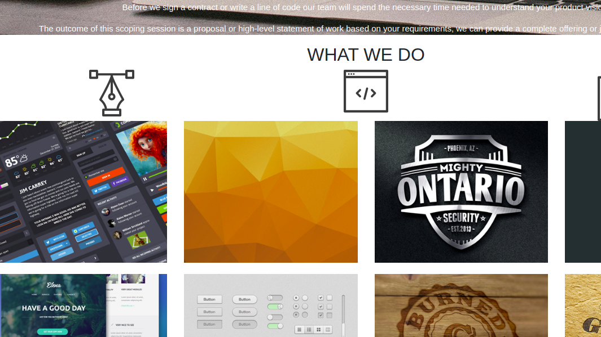

# Delani Studio
 By Roselyne Akhonya.
## Description
This is a web application that belongs to a software engineer who helps his clients in developing programs and other applications. 
## Visual representation
 

## BDD
This application functions in such a way that it gives you the details of the business by  
## Techologies used
This application was developed by incorporating the use of:
- HTML 
- CSS
- Bootstrap
- Javascript
- Jquery
## Accessibility
Find the application on ""
## Contributions
- Go to github search Roseakhonya/Name-generator
- Fork it
- Create your own branches
- Add and commit your changes
- Push it to the branch
- Submit a pull request
## Contacts and support
For more information feel free to reach out on akhonyarose@gmail.com
## License
The MIT License (MIT)

Copyright (c) 2019 Rose Akhonya